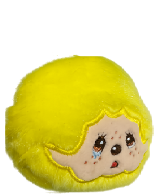
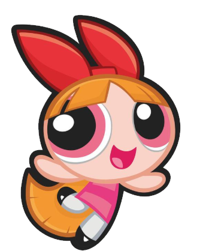

# 🛡️ Tiny Guardian — ผู้พิทักษ์ตัวจิ๋ว

> เกม platformer สไตล์ Bubble Bobble สำหรับเด็ก 6–12 ปี  
> เล่นคนเดียวหรือ 2 คน Online Co-op ได้เลย!

🎮 **[เล่นเลย → uwwa34.github.io/TinyGuardian](https://uwwa34.github.io/TinyGuardian)**

---

## 📸 Screenshots

| Intro | Gameplay | Co-op |
|---|---|---|
|  |  |  |

---

## 🎮 วิธีเล่น

### บนมือถือ (Touch)
| ปุ่ม | หน้าที่ |
|---|---|
| ◀ / ▶ | เดินซ้าย / ขวา |
| **A** | กระโดด (กดค้างไว้ = กระโดดสูงขึ้น) |
| **B** | ยิง (กดค้าง 1.5 วิ = Charge Shot!) |

### บน PC (Keyboard)
| ปุ่ม | หน้าที่ |
|---|---|
| `A` / `D` หรือ `←` / `→` | เดินซ้าย / ขวา |
| `Space` | กระโดด |
| `B` | ยิง / Charge Shot |

---

## 👥 Online Co-op

1. คนแรกกด **"เล่น 2 คน (Online)"** → **"สร้างห้อง"** → ได้รหัส 4 ตัว
2. บอกรหัสให้เพื่อน → เพื่อนกด **"เข้าห้อง"** → ใส่รหัส
3. Host กด **"เริ่มเกม!"**

> ⚠️ Server ใช้ Render.com Free Tier — อาจใช้เวลา 30–60 วินาทีในการเชื่อมต่อครั้งแรก เนื่องจาก server sleep หลังไม่มีการใช้งาน 15 นาที

---

## 🗺️ เนื้อหาในเกม

### 4 ด่าน
| ด่าน | ธีม | ศัตรู | บอส |
|---|---|---|---|
| 1 🏫 | โรงเรียน | ยางลบ, ดินสอ | — |
| 2 🎪 | สวนสนุก | ตัวตลก, บอลลูน, บูมเมอแรง | — |
| 3 🍬 | โลกขนม | ลูกกวาด, คุกกี้, เยลลี่ | 🧁 คัพเค้กยักษ์ |
| 4 🏰 | ปราสาท | ผสมทุกประเภท | 👿 จอมวายร้ายจิ๋ว (3 Phase) |

### ระดับความยาก
| | ง่าย 🟢 | ปกติ 🟡 | ยาก 🔴 |
|---|---|---|---|
| HP ผู้เล่น | 12 | 10 | 8 |
| HP ศัตรู | ×0.7 | ×1.0 | ×1.4 |
| ความเร็วศัตรู | ×0.8 | ×1.0 | ×1.2 |
| HP บอส | ×0.6 | ×1.0 | ×1.5 |

---

## 🏗️ โครงสร้างโปรเจกต์

```
tiny-guardian/
├── index.html              — Boot loader, asset loading, canvas scaling
├── manifest.json           — PWA manifest
├── js/
│   ├── settings.js         — Config ทั้งหมด (physics, colors, enemies, stages)
│   ├── player.js           — Player movement, jump, charge attack
│   ├── world.js            — Platforms (static/moving/disappearing), background
│   ├── enemy.js            — Enemy AI (ground/fly/bounce), spawn
│   ├── projectile.js       — Player bullets + Enemy projectiles
│   ├── items.js            — Items (Coin/Special/Heart)
│   ├── boss.js             — MiniBoss + Final Boss, AI phases
│   ├── hud.js              — HP hearts, scores, timer, charge bar
│   ├── ranking.js          — Tally, Name entry, Leaderboard (localStorage)
│   ├── network.js          — WebSocket Co-op client + Lobby UI
│   └── game.js             — Main loop, state machine, audio, input
└── assets/
    ├── images/             — Sprites (player, enemies, boss, backgrounds)
    └── sounds/             — SFX (.wav) + BGM (.mp3)
```

---

## ⚙️ Tech Stack

- **Vanilla JavaScript** — ไม่มี framework, ไม่มี bundler
- **HTML5 Canvas** — 390×720px portrait
- **Web Audio API** — SFX พร้อม iOS unlock
- **WebSocket** — Online Co-op ผ่าน Node.js relay server
- **PWA** — ติดตั้งได้บน iOS/Android
- **GitHub Pages** — Host เกม
- **Render.com** — Host Co-op server (Free Tier)

---

## 🚀 Deploy

### เกม (GitHub Pages)
```
1. Push โค้ดขึ้น main branch
2. Settings → Pages → Deploy from branch → main / (root)
3. เกมจะอยู่ที่ https://<username>.github.io/<repo-name>
```

### Co-op Server (Render.com)
```
1. สร้าง repo แยกสำหรับ server/ folder
2. Render.com → New Web Service → เชื่อมต่อ repo
3. Build: npm install  |  Start: node server.js  |  Plan: Free
4. แก้ COOP_SERVER_URL ใน js/settings.js ให้ตรงกับ Render URL
```

---

## 🔧 การพัฒนาต่อ

### เพิ่มศัตรูใหม่
1. เพิ่ม entry ใน `ENEMY` object ใน `settings.js`
2. เพิ่มเข้า `STAGE_WAVES` ของด่านที่ต้องการ
3. (Optional) เพิ่ม image key ใน `ASSET_IMAGES`

### เพิ่มด่านใหม่
1. เพิ่ม platform layout ใน `PLAT_PRESETS[5]` ใน `settings.js`
2. เพิ่ม waves ใน `STAGE_WAVES[5]`
3. เพิ่ม `STAGE_TIME[5]`, `STAGE_COL[5]`
4. แก้ `currentStage > 4` → `> 5` ใน `game.js`

### ปรับ Difficulty
แก้ค่าใน `DIFFICULTY` object ใน `settings.js` — multipliers ถูก apply อัตโนมัติ

### เพิ่ม BGM
วาง `bgm.mp3` ไว้ที่ `assets/sounds/bgm.mp3` — โหลดและเล่นอัตโนมัติเมื่อเริ่มเกม

---

## 🎵 Assets ที่ต้องการ

### รูปภาพ (assets/images/)
| ไฟล์ | ขนาดแนะนำ | หมายเหตุ |
|---|---|---|
| `player.png` | 52×60px | ผู้เล่น P1 |
| `player2.png` | 52×60px | ผู้เล่น P2 (optional) |
| `enemy_ground.png` | 50×50px | ศัตรูเดิน |
| `enemy_air.png` | 50×50px | ศัตรูบิน |
| `miniboss.png` | 96×96px | บอสด่าน 3 |
| `boss.png` | 150×150px | บอสด่าน 4 |
| `bg_stage1-4.png` | 390×590px | พื้นหลังแต่ละด่าน |

### เสียง (assets/sounds/)
| ไฟล์ | ใช้เมื่อ |
|---|---|
| `bgm.mp3` | เพลงประกอบ (loop) |
| `jump.wav` | กระโดด |
| `dash.wav` | ยิงปกติ / charge release |
| `start.wav` | charge เต็ม |
| `hit.wav` | โดนโจมตี |
| `boss_hit.wav` | บอสโดนยิง / ศัตรูตาย |
| `coin.wav` | เก็บ item |
| `boss_clear.wav` | ผ่านด่าน |
| `warning.wav` | บอสปรากฏ |
| `die.wav` | เสียชีวิต |

---

## 📝 Known Issues

- [ ] Co-op: P2 Tally อาจ miss ถ้า network packet หล่น (retry 3 ครั้งแล้ว)
- [ ] BGM per stage (ปัจจุบันใช้ไฟล์เดียว)
- [ ] Enemy sprite ยังแชร์กัน (enemy_ground / enemy_air)
- [ ] Render.com free tier sleep → connect ช้า 30–60s ครั้งแรก

---

## 📄 License

MIT License — ใช้ได้อิสระ, เครดิตยินดีรับ 🙏
